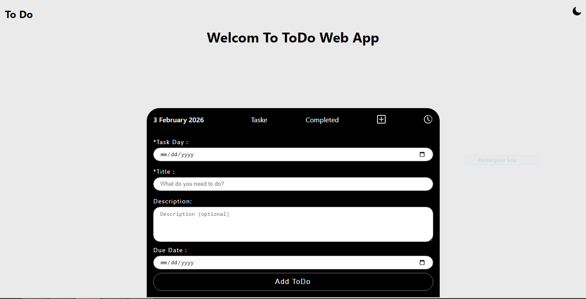

# Laravel Todo App with Authentication


 <!-- جایگزین مسیر اسکرین شات خودت -->

## Overview

This is a **Todo App** built with **Laravel (Backend)** and **Vanilla JavaScript (Frontend)**. It allows users to **register, login, and manage their tasks** with a clean and responsive UI. The app also supports **dark/light theme**, **task completion**, **editing**, and **deleting tasks**, with **loading, success, and error animations**.

### Features

- User **registration** and **login** with session-based authentication.
- **Add, update, and delete tasks** for authenticated users.
- Mark tasks as **completed**.
- **Dynamic rendering** of completed and active tasks.
- Responsive design from **mobile to desktop**.
- Dark and light **theme toggle**.
- **Smooth animations** for loading, success, and errors.
- Input validation on both frontend and backend.
- Modular structure with **Services** and **Policies** for better maintainability.

---
## Security & Authorization

- Authentication is handled using **Laravel session-based authentication**.
- Authorization is enforced via **Policies**.
- Users can only access and modify their own tasks.
- **CSRF protection** is enabled for all requests.

### Why Session-Based Authentication?

Session-based authentication was chosen because this application is a **server-rendered web app (Blade + Vanilla JavaScript)** rather than a SPA or mobile API-based system. Using sessions provides:

- Better **built-in security** with Laravel (CSRF protection, session regeneration).
- Simpler implementation without managing tokens on the client side.
- Automatic session invalidation on logout.
- Easier integration with **Policies and middleware**.
- Reduced risk of token leakage compared to storing JWTs in the browser.

For this project’s scope, session-based authentication offers a **secure, clean, and maintainable solution**.

---
### Screenshots

| Home Page | Add/Edit Task |
|-----------|---------------|
|  |  |

| Desktop | Mobile |
|--------|--------|
|  |  |


### Demo

You can see the live demo [here](https://your-demo-link.com)(Demo).

---

## Installation

1. Clone the repository:
```bash
git clone https://github.com/YourUsername/todo-app.git

cd todo-app

composer install

npm install

cp .env.example .env

php artisan key:generate

php artisan migrate

php artisan serve
```
---
## Folder Structure
```bash
app/
├─ Http/
│  ├─ Controllers/
│  │  ├─ AuthController.php
│  │  ├─ PageController.php
│  │  └─ TodoController.php
│  ├─ Requests/
│  │  ├─ AddTodoRequest.php
│  │  ├─ LoginRequest.php
│  │  └─ RegisterRequest.php
│  ├─ Policies/
│  │  └─ TodoPolicy.php
├─ Models/
│  ├─ User.php
│  └─ Todo.php
├─ Services/
│  ├─ AddTodoService.php
│  ├─ UpdateTodoService.php
│  ├─ LoginService.php
│  └─ RegisterService.php

resources/
├─ views/
│  ├─ auth/
│  │  ├─ login.blade.php
│  │  └─ register.blade.php
│  └─ todo/
│     └─ home.blade.php
├─ css/
│  └─ main.css
├─ js/
│  └─ app.js

public/
├─ assets/
│  ├─ images/
│  └─ icons/

```

---

## How It Works

- User registers via /register and logs in via /login.
- Authenticated users can add tasks through a form.
- Tasks are shown in active and completed sections.
- Each task can be edited, marked as complete, or deleted.
- Policies ensure users can only manage their own tasks.

---
### Tech Stack

- Backend: Laravel 10, PHP 8
- Frontend: Vanilla JS, HTML5, CSS3
- Database: MySQL/PostgreSQL (configurable)
- Other: CSS variables for theme, responsive design with media queries, - custom JS for dynamic content.

---

### Notes for Contributors / Usage
- All task operations are via fetch API.
- Dark/light theme is applied using CSS variables.
- No frameworks like React are used in frontend (vanilla JS + Blade).